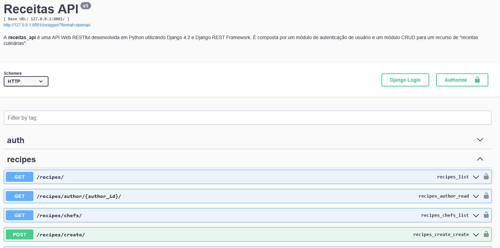

# Receitas API

## Descrição

Projeto de API Web feita durante processo seletivo para uma vaga de Desenvolvedor Backend.

A **receitas_api** é uma API Web RESTful desenvolvida em Python utilizando Django 4.2 e Django REST Framework. É composta por um módulo de autenticação de usuário e um módulo CRUD para um recurso de "receitas culinárias".



## Setup

Um ambiente de desenvolvimento para este projeto pode ser executado e testado utilizando um container Docker. [Instale o Docker](https://docs.docker.com/get-docker/) antes de começar.

No diretório do repositório, execute este comando para criar e iniciar o container:

 ```
docker compose up -d --build
 ```
Após a conclusão da build, abra um *shell* dentro do container:

 ```
docker exec -it <container-name-or-id> sh
 ```

No *shell* do container, aplique as migrações no banco de dados:

 ```
python manage.py migrate
 ```

(*opcional*) Crie um super usuário com:

 ```
python manage.py createsuperuser
 ```

(*opcional*) Execute os testes disponíveis:

 ```
python manage.py test apps/
 ```

Após a montagem do container a documentação da API estará disponível em [Redoc](http://127.0.0.1:8001/redoc/) e [Swagger](http://127.0.0.1:8001/swagger/).

## Autenticação

Para consumir os endpoints desta API é necessário registrar e autenticar um usuário de API. Utilize o endpoint ``/auth/register/`` para registrar um usuário.

Para obter Token de autenticação de usuário utilize o endpoint ``/auth/token/``. Para autenticar suas requisições utilizando o token adicione o seguinte header:
``Authorization: Token <token>``

A autenticação por sessão também está habilitada na API, basta realizar o login pelo endpoint ``/auth/login/``